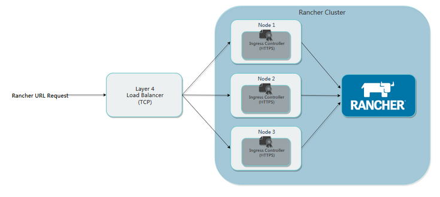
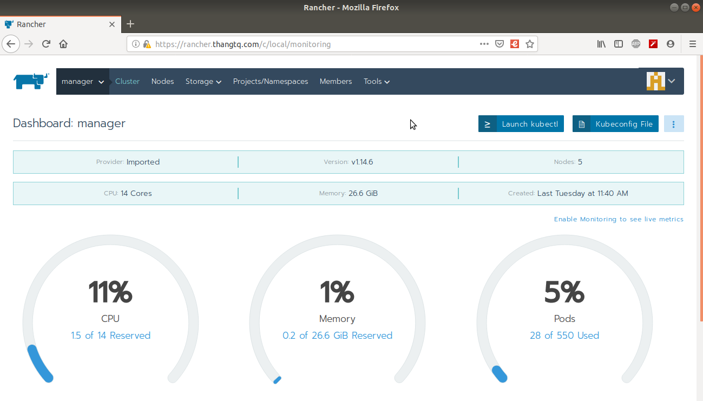

### I. HA Rancher install with layer 4 load balancer, depicting SSL termination at ingress controllers




- 192.168.1.10 - nginx1 (LB1)
- 192.168.1.11 - nginx2 (LB2)

- 192.168.1.12 - master1
- 192.168.1.13 - master2
- 192.168.1.14 - master3

- 192.168.1.15 - worker1
- 192.168.1.16 - worker2

### II. Steps:

- 1.Install docker on master + worker
- 2.Install and config Load Balancer
- 3.Install k8s với RKE
- 4.Install Helm(Tiller)
- 5.Install Rancher

### 1. Install docker on master + worker

```
curl https://releases.rancher.com/install-docker/18.09.sh | sh
```

### 2. Install and config LoadBalancer

- Run on node nginx1 + nginx2:

- Enable VIP

```
vim /etc/sysctl.conf

net.ipv4.ip_nonlocal_bind=1

sysctl -p
```

- Install and config nginx

```
apt install nginx

cat > /etc/nginx/nginx.conf <<EOF

user www-data;
worker_processes auto;
pid /run/nginx.pid;
include /etc/nginx/modules-enabled/*.conf;

events {
        worker_connections 1024;
        # multi_accept on;
}

http {
    # Gzip Settings
    gzip on;
    gzip_disable "msie6";
    gzip_disable "MSIE [1-6]\.(?!.*SV1)";
    gzip_vary on;
    gzip_static on;
    gzip_proxied any;
    gzip_min_length 0;
    gzip_comp_level 8;
    gzip_buffers 16 8k;
    gzip_http_version 1.1;
    gzip_types text/xml application/xml application/atom+xml application/rss+xml application/xhtml+xml image/svg+xml application/font-woff text/javascript application/javascript application/x-javascript text/x-json application/json application/x-web-app-manifest+json text/css text/plain text/x-component font/opentype application/x-font-ttf application/vnd.ms-fontobject font/woff2 image/x-icon image/png image/jpeg;

    server {
        listen         80;
        return 301 https://$host$request_uri;
    }
}

stream {
    upstream rancher_servers {
        least_conn;
        server 192.168.1.12:443 max_fails=3 fail_timeout=2s;
        server 192.168.1.13:443 max_fails=3 fail_timeout=2s;
        server 192.168.1.14:443 max_fails=3 fail_timeout=2s;
    }
    server {
        listen     443;
        proxy_pass rancher_servers;
    }
}

EOF

systemctl restart nginx
```

- Intall and config keepalived

```
apt install keepalived

cat > /etc/keepalived/keepalived.conf <<EOF

vrrp_script check_nginx {
script "killall -0 nginx"
interval 3
weight 3
}

vrrp_instance LAN_133 {
interface ens33
virtual_router_id 133
priority 133
advert_int 2

authentication {
  auth_type PASS
  auth_pass ahihi
}

track_script {
  check_nginx
}

virtual_ipaddress {
  192.168.1.100/24
  }
}

EOF

systemctl restart keepalived
```

### 3. Install k8s with RKE

- Install rke (run on master1 or master2 or master3)

```
wget https://github.com/rancher/rke/releases/download/v0.2.8/rke_linux-amd64
mv rke_linux-amd64 /usr/local/bin/rke
chmod +x /usr/local/bin/rke
```

- Create file rancher-cluster.yml

```
cat > rancher-cluster.yml <<EOF

nodes:
  - address: 192.168.1.12
    user: root
    port: 22
    ssh_key_path: ~/.ssh/id_rsa
    labels:
      app: ingress-master
    role: [controlplane,etcd,worker]
  - address: 192.168.1.13
    user: root
    port: 22
    ssh_key_path: ~/.ssh/id_rsa
    labels:
      app: ingress-master
    role: [controlplane,etcd,worker]
  - address: 192.168.1.14
    user: root
    port: 22
    ssh_key_path: ~/.ssh/id_rsa
    role: [controlplane,etcd,worker]
    labels:
      app: ingress-master
    
  - address: 192.168.1.15
    user: root
    port: 22
    ssh_key_path: ~/.ssh/id_rsa
    role: [worker]
    labels:
      host: microsite1
  - address: 192.168.1.16
    user: root
    port: 22
    ssh_key_path: ~/.ssh/id_rsa
    role: [worker]
    labels:
      host: microsite2

services:
  etcd:
    snapshot: true
    creation: 6h
    retention: 24h

ingress:
    provider: nginx
    node_selector:
      app: ingress-master

```

- Install k8s:

```
rke up --config ./rancher-cluster.yml
```

- Check the Health of cluster k8s

```
kubectl get pods --all-namespaces

NAMESPACE       NAME                                      READY     STATUS      RESTARTS   AGE
ingress-nginx   nginx-ingress-controller-tnsn4            1/1       Running     0          30s
ingress-nginx   nginx-ingress-controller-tw2ht            1/1       Running     0          30s
ingress-nginx   nginx-ingress-controller-v874b            1/1       Running     0          30s
kube-system     canal-jp4hz                               3/3       Running     0          30s
kube-system     canal-z2hg8                               3/3       Running     0          30s
kube-system     canal-z6kpw                               3/3       Running     0          30s
kube-system     kube-dns-7588d5b5f5-sf4vh                 3/3       Running     0          30s
kube-system     kube-dns-autoscaler-5db9bbb766-jz2k6      1/1       Running     0          30s
kube-system     metrics-server-97bc649d5-4rl2q            1/1       Running     0          30s
kube-system     rke-ingress-controller-deploy-job-bhzgm   0/1       Completed   0          30s
kube-system     rke-kubedns-addon-deploy-job-gl7t4        0/1       Completed   0          30s
kube-system     rke-metrics-addon-deploy-job-7ljkc        0/1       Completed   0          30s
kube-system     rke-network-plugin-deploy-job-6pbgj       0/1       Completed   0          30s
```

- Install kubectl

```
curl -LO https://storage.googleapis.com/kubernetes-release/release/`curl -s https://storage.googleapis.com/kubernetes-release/release/stable.txt`/bin/linux/amd64/kubectl
chmod +x ./kubectl
mv ./kubectl /usr/local/bin/kubectl
```

### 4. Install Helm(Tiller)

```
wget https://get.helm.sh/helm-v2.14.2-linux-amd64.tar.gz
tar -zxvf helm-v2.14.2-linux-amd64.tar.gz 
cd linux-amd64/
cp helm /usr/local/bin/
```

- Install Tiller on the Cluster

```
kubectl -n kube-system create serviceaccount tiller

kubectl create clusterrolebinding tiller \
  --clusterrole=cluster-admin \
  --serviceaccount=kube-system:tiller

helm init --service-account tiller
```

- Check Tiller installation

```
kubectl -n kube-system  rollout status deploy/tiller-deploy
Waiting for deployment "tiller-deploy" rollout to finish: 0 of 1 updated replicas are available...
deployment "tiller-deploy" successfully rolled out
```

### 5. Install Rancher

- Add the Helm Chart Repository (Stable: Recommended for production)

```
helm repo add rancher-stable https://releases.rancher.com/server-charts/stable
```

- Install cert-manager Helm chart

```
kubectl apply -f https://raw.githubusercontent.com/jetstack/cert-manager/release-0.9/deploy/manifests/00-crds.yaml

kubectl create namespace cert-manager

kubectl label namespace cert-manager certmanager.k8s.io/disable-validation=true

helm repo add jetstack https://charts.jetstack.io

helm repo update

helm install \
  --name cert-manager \
  --namespace cert-manager \
  --version v0.9.1 \
  jetstack/cert-manager

```

- Check cert-manager installation

```
kubectl get pods --namespace cert-manager

NAME                                            READY   STATUS      RESTARTS   AGE
cert-manager-7cbdc48784-rpgnt                   1/1     Running     0          3m
cert-manager-webhook-5b5dd6999-kst4x            1/1     Running     0          3m
cert-manager-cainjector-3ba5cd2bcd-de332x       1/1     Running     0          3m
```

- Rancher Generated Cert

```
helm install rancher-stable/rancher \
  --name rancher \
  --namespace cattle-system \
  --set hostname=rancher.thangtq.com
```

- Wait for Rancher check installation

```
kubectl -n cattle-system rollout status deploy/rancher
Waiting for deployment "rancher" rollout to finish: 3 of 3 updated replicas are available...
deployment "rancher" successfully rolled out
```

- Login web `rancher.thangtq.com`



- Fix cattle-cluster-agent Pod and cattle-node-agent can not find the Rancher server through DNS records

```
kubectl -n cattle-system \
patch deployments cattle-cluster-agent --patch '{
    "spec": {
        "template": {
            "spec": {
                "hostAliases": [
                    {
                        "hostnames":
                        [
                            "rancher.thangtq.com"
                        ],
                            "ip": "192.168.1.100"
                    }
                ]
            }
        }
    }
}'
```

```
kubectl -n cattle-system \
patch  daemonsets cattle-node-agent --patch '{
    "spec": {
        "template": {
            "spec": {
                "hostAliases": [
                    {
                        "hostnames":
                        [
                            "rancher.thangtq.com"
                        ],
                            "ip": "192.168.1.100"
                    }
                ]
            }
        }
    }
}'
```

- Check rancher installation

```
kubectl get pod --all-namespaces
NAMESPACE       NAME                                      READY   STATUS      RESTARTS   AGE
cattle-system   cattle-cluster-agent-596b8b4769-xr6gm     1/1     Running     0          2d4h
cattle-system   cattle-node-agent-2f84v                   1/1     Running     1          2d3h
cattle-system   cattle-node-agent-kttph                   1/1     Running     0          2d4h
cattle-system   cattle-node-agent-lb5rv                   1/1     Running     1          2d4h
cattle-system   cattle-node-agent-r5qrr                   1/1     Running     0          18h
cattle-system   cattle-node-agent-w47p2                   1/1     Running     0          2d4h
cattle-system   rancher-797f8646f6-9tgmn                  1/1     Running     2          2d4h
cattle-system   rancher-797f8646f6-fgkg6                  1/1     Running     1          6h6m
cattle-system   rancher-797f8646f6-gqbzs                  1/1     Running     4          2d4h
cert-manager    cert-manager-5b9ff77b7-m5pzw              1/1     Running     0          2d4h
cert-manager    cert-manager-cainjector-59d69b9b-2t2m2    1/1     Running     1          2d4h
cert-manager    cert-manager-webhook-cfd6587ff-htvhk      1/1     Running     0          2d4h
ingress-nginx   default-http-backend-5954bd5d8c-kvmsk     1/1     Running     0          2d4h
ingress-nginx   nginx-ingress-controller-56hzd            1/1     Running     0          2d4h
ingress-nginx   nginx-ingress-controller-qfm9z            1/1     Running     0          2d1h
ingress-nginx   nginx-ingress-controller-w9wl7            1/1     Running     0          2d4h
kube-system     canal-88gss                               2/2     Running     2          2d4h
kube-system     canal-c5xpl                               2/2     Running     0          2d4h
kube-system     canal-cl6hm                               2/2     Running     0          18h
kube-system     canal-k6qz6                               2/2     Running     0          2d4h
kube-system     canal-ss8b2                               2/2     Running     2          2d3h
kube-system     coredns-autoscaler-5d5d49b8ff-x72t6       1/1     Running     0          2d4h
kube-system     coredns-bdffbc666-728kb                   1/1     Running     0          18h
kube-system     coredns-bdffbc666-h5dmx                   1/1     Running     1          2d4h
kube-system     metrics-server-7f6bd4c888-whp6r           1/1     Running     0          2d4h
kube-system     rke-coredns-addon-deploy-job-dvpft        0/1     Completed   0          2d4h
kube-system     rke-ingress-controller-deploy-job-vbmvx   0/1     Completed   0          2d4h
kube-system     rke-metrics-addon-deploy-job-b99hb        0/1     Completed   0          2d4h
kube-system     rke-network-plugin-deploy-job-rgnfs       0/1     Completed   0          2d4h
kube-system     tiller-deploy-7f656b499f-q2l7l            1/1     Running     0          2d4h
```

### Reference resources:

- https://rancher.com/docs/rancher/v2.x/en/installation/requirements
- https://rancher.com/docs/rancher/v2.x/en/installation/ha
- https://rancher.com/docs/rke/latest/en/example-yamls/
