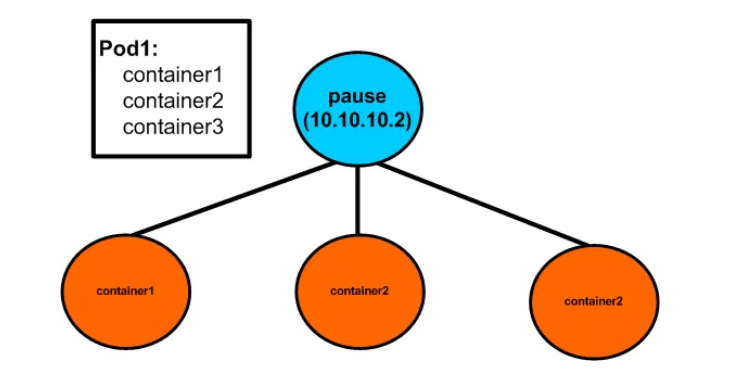
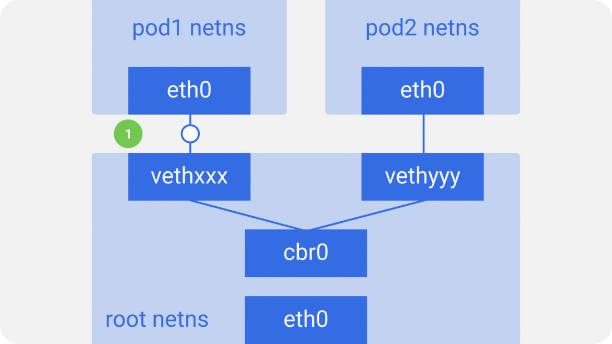
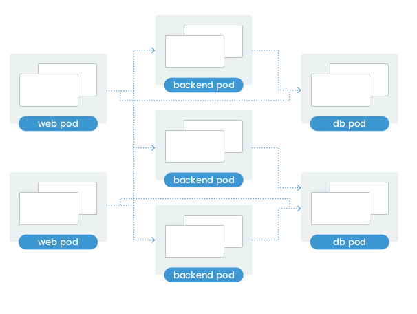

### 1. Giới thiệu:

- Một trong những phần phức tạp và quan trọng nhất khi tìm hiểu về k8s là phần Network. Để hiểu rõ về network trong k8s, ta cần tập trung vào 4 phần:

	* Network on Pod
	
	* Pod-to-Pod communications
	
	* Pod-to-Service communications
	
	* External-to-Service communications

### 2. Network on Pod

- Trong k8s, mỗi Pod có 1 IP.

- IP của 1 pod được chia sẻ bởi tất cả các container trong Pod này, và mặc định nó có thể kết nối từ tất cả các Pod khác trong 1 cụm k8s. 

- Bạn có bao giờ để ý thấy 1 số container `pause` đang chạy trên tất cả các node trong k8s? 
  
  

- Chúng được gọi là các `sandbox containers`, có nhiệm vụ lưu giữ `network namespace` (netns) được chia sẻ bởi tất cả các container trong 1 pod. Với cơ chế này, trong 1 Pod khi 1 container chết hoặc 1 container mới được tạo thì IP Pod sẽ không bị thay đổi.

### 3. Pod-to-Pod communications

- Trong k8s, để kết nối giữa các pods, ta cần sử dụng 1 network plugin ngoài như Flannel, Calico, Cannal, Weave... Ở trong bài này, tôi sẽ nói về sử dụng `Flannel` để kết nối giữa các pods trong k8s.

### 3.1. Flannel

### Khái niệm: 

- Flannel là một giải pháp overlay network được sử dụng để cấu hình network trong k8s. Về cơ bản, cơ chế overlay networks sẽ sử dụng backend (VXLAN, GRE...) để đóng gói `packet-in-packet` đi qua underlay networks (hạ tầng mạng vật lí cơ bản). Ở đây, Flannel sử dụng backend VXLAN.

- Flannel chạy 1 tiến trình agent có tên là flanneld trên tất cả các node trong cụm k8s. Tiến trình này chịu trách nhiệm phân bổ `subnet lease` trên mỗi node.

- Flannel sẽ lưu tất cả các thông tin vào etcd: lưu trữ cấu hình mạng, subnet được phân bổ như nào và bất kì dữ liệu phụ trợ nào khác ( như IP public của host).

### Kết nối giữa các Pod trên 1 node

 
 
- Trên mỗi node trong cụm k8s (chạy hệ điều hành linux) sẽ có 1 `root network namespace` ( root netns). Interface chính `eth0` nằm trong `root network namespace` này.

- Tương tự, mỗi pod sẽ có netns riêng, với 1 virtual ethernet (veth) kết nối nó tới `root netns`. Bạn có thể hiểu `veth` là 1 đường ống để kết nối với 2 đầu, 1 đầu được gắn với root netns và đầu còn lại gắn với pod netns.

    

- Bạn có thể liệt kê tất cả các network interface trên node với lệnh `ifconfig` hoặc `ip a`.

- Với plugin network Flannel, sẽ sử dụng 1 bridge `cni0` để các pod trên 1 node nói chuyện với nhau.

  
  
- Bạn có thể list các bridge bằng lệnh `brctl show`.

- Traffic flows:
  
  

	* 1.Gói tin từ pod1 đi vào root netns tại `vethxx`.
  
	* 2.Gói tin được chuyển tới bridge `cbr0`, để phát hiện ra đích đến của gói tin bằng cách sử dụng `ARP request`, nói rằng pod nào có IP này? 
  
	* 3.`vethyyy` nói rằng nó có IP đó, vì vậy bridge `cbr0` sẽ biết nơi chuyển tiếp gói tin.
  
	* 4.Gói tin được gửi đến `vethyyy`, và gửi đến pod2.
  
### Kết nối giữa các pod trên các node khác nhau

- Mỗi node trong cụm k8s sẽ được gán 1 `CIDR block` (1 dải địa chỉ IP) để cấp cho các pods, vì vậy mỗi pod có 1 IP duy nhất và không bị conflict với các pods trên tất cả các node khác trong cụm k8s.

### Traffic flows

  

- Luồng gói tin gửi từ pod1 đến pod4 (trên node khác):
 
	* 1.Gói tin từ `pod1` netns tại `eth0` trên pod 1 được gửi vào root netns tại `vethxxx`.
  
  	* 2.Gói tin chuyển tới `cbr0`, và gửi yêu cầu ARP để tìm destination của gói tin.
  
  	* 3a.Vì không pod nào trên node này có địa chỉ IP cho `pod4`, nên bridge `cbr0` gửi nó tới `flannel0`. Vì bảng định tuyến của node được cấu hình với `flannel0` làm mục tiêu cho range IP pod. Các thông tin cấu hình này được lưu ở `etcd`.
  
  	* 3b.Tiến trình `flanneld` daemon đọc thông tin trong `etcd`, nó sẽ biết về tất cả các IP của pod và các dải IP của pod đang nằm trên node nào. Vì vậy, `flannel` sẽ ánh xạ các IP pod với IP của các node. `flannel0` lấy gói tin này và đóng gói vào trong gói UDP với các header bổ sung thay đổi IP nguồn và IP đích đến các node tương ứng và gửi nó đến 1 port đặc biệt `vxlan` (thường là 8472).
  
    
	
	* 3c.Gói tin này được đóng gói và gửi qua eth0.
	
	* 4.Gói tin rời khỏi node với sourceIP là IP node1 và destIP là IP node2.
	
	* 5.Bảng định tuyến của mạng vật lí đã biết cách định tuyến giữa các node, do đó nó gửi gói tin đến node2.
	
	* 6a.Gói tin này đến `eth0` của node2. Do port là port đặc biệt `vxlan`, kernel sẽ gửi gói tin đến `flannel0`.
	
	* 6b.`flannel0` sẽ thực hiện de-capsulates và gửi nó vào trong root netns.
	
	* 6c.`Vì IP forwarding được enabled`, kernel sẽ chuyển tiếp gói tin tới `cbr0`.
	
	* 7.Bridge `cbr0` sẽ lấy gói tin và thực hiện 1 request ARP và phát hiện ra rằng IP này thuộc về `vethyyy`.
	
	* 8.Gói tin sẽ đi qua `vethyyy` và được gửi tới pod4.

- Một số lưu ý khi sử dụng Flannel:
	
	* Flannel sử dụng công nghệ `vxlan`: không có mã hóa giữa các node.
	
	* Flannel không hỗ trợ NetworkPolicy trong k8s.

### NetworkPolicy trong k8s

- Mặc định trong 1 cụm k8s, tất cả các Pod sẽ nói chuyện được với nhau. Để tăng tính bảo mật cho các ứng dụng, trong k8s sử dụng resource `NetworkPolicy`.

- `NetworkPolicy` cho phép bảo mật các ứng dụng bằng cách cung cấp các Policy để kiểm soát các kết nối vào/ra giữa các pods trong k8s. Tuy nhiên, bản thân k8s không có khả năng thực thi các network policy này. Để thực thi các network policy, ta cần phải sử dụng 1 network plugin có khả năng thực thi các network policy này (Calico, Cannal...).

- Trước khi cấu hình NetworkPolicy:

  

- Sau khi cấu hình NetworkPolicy:
  
  

**Ví dụ về NetworkPolicy:

- Các pod:
  
  ```
  kubectl get pod -o wide
  NAME                        READY   STATUS    RESTARTS   AGE     IP               NODE      NOMINATED NODE   READINESS GATES
  backend-6db5cdbb4b-b9tdm    1/1     Running   0          2m36s   192.168.189.77   worker2   <none>           <none>
  db-5b54c87fdb-v6rl2         1/1     Running   0          3m36s   192.168.189.75   worker2   <none>           <none>
  frontend-5575ff85dd-76frq   1/1     Running   0          2m42s   192.168.189.76   worker2   <none>           <none>
  frontend-5575ff85dd-gz467   1/1     Running   0          2m42s   192.168.182.8    worker3   <none>           <none>
  frontend-5575ff85dd-hd9rf   1/1     Running   0          2m42s   192.168.182.7    worker3   <none>           <none>
  ```
  
- Trước khi cấu hình Networkpolicy, các pod web(frontend) sẽ nói chuyện được với các db pod. Thực hiện trên pod `frontend-5575ff85dd-76frq` ping đến pod `db-5b54c87fdb-v6rl2`:
  
  ```
  root@frontend-5575ff85dd-76frq:/# ping 192.168.189.75 -c 2
  PING 192.168.189.75 (192.168.189.75) 56(84) bytes of data.
  64 bytes from 192.168.189.75: icmp_seq=1 ttl=63 time=0.156 ms
  64 bytes from 192.168.189.75: icmp_seq=2 ttl=63 time=0.129 ms
  ```
  
- Cấu hình 1 NetworkPolicy chỉ cho phép các pod backend kết nối đến pod database, các pod web(frontend) sẽ không được phép kết nối tới các pod db.

  ```
  vim networkpolicy.yaml
  
  kind: NetworkPolicy
  apiVersion: networking.k8s.io/v1
  metadata:
    name: db-access-ingress
  spec:
    podSelector:
      matchLabels:
        role: db
  ingress:
    - from:
      - podSelector:
          matchLabels:
            role: backend
  ```

*NetworkPolicy trên chỉ ra rằng sẽ chỉ cho phép các kết nối từ các pods có label là `role:backend` vào các pods có label là `role:db`.

- Apply networkPolicy: 

  ```
  kubectl apply -f networkpolicy.yaml
  networkpolicy.networking.k8s.io/backend-access-ingress created
  networkpolicy.networking.k8s.io/db-access-ingress created

- Sau khi config NetworkPolicy trên, ta thực hiện test, vẫn ở trên pod `frontend-5575ff85dd-76frq` ping đến pod `db-5b54c87fdb-v6rl2`:

  ```
  root@frontend-5575ff85dd-76frq:/# ping 192.168.189.75 -c 2 -t 3
  PING 192.168.189.75 (192.168.189.75) 56(84) bytes of data.
  --- 192.168.189.75 ping statistics ---
  2 packets transmitted, 0 received, 100% packet loss, time 1014ms
  ```
  
### 4. Pod-to-Service communications.

- Để kết nối các app trong 1 cụm hoặc với các app ngoài cụm, k8s sử dụng `service`.

- Pod trong k8s không có sự đảm bảo về địa chỉ IP cố định, giả sử 1 pod gặp sự cố và được khởi tạo lại, pod mới này có thể sẽ được gán cho 1 IP khác -> Service được ra đời
    
- Service được dùng để nhóm lại một hoặc nhiều Pod bằng Label Selector.

- Có thể hiểu thì Service giống như domain, còn Pod chạy ứng dụng chính là server và việc của domain là trỏ đến IP của server đang chạy website. Nhưng tuyệt vời hơn, thay vì một bản ghi DNS của domain chỉ trỏ được đến 1 IP thì service có thể trỏ đến nhiều pods cùng chạy ứng dụng, và khi đó Service đóng vai trò là một Internal LoadBalancer.

- Service gồm có 3 kiểu:

	* ClusterIP
	
	* NodePort
	
	* LoadBalancer


	


